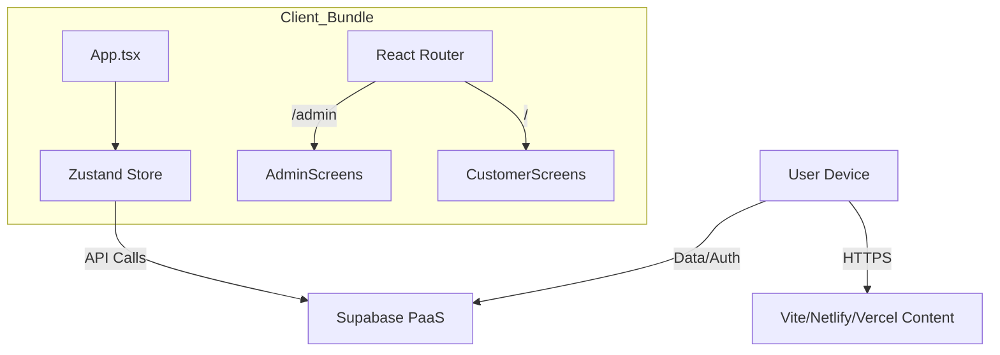

# Architectural Audit: Brew Coffee

**Date:** 2026-02-15
**Target:** `brew_Coffee` (React/Vite/Supabase)
**Auditor:** Principal Systems Architect

## 1) Executive Summary
**Architecture:** Client-side Monolith (SPA) using React 19 + Supabase.
**Verdict:** **Prototype Grade / High Risk.**
The application mixes Customer and Admin logic in a single client-side bundle. Security relies on "security by obscurity" (client-side toggle for Admin mode). While the tech stack (React 19, Zustand, Supabase) is modern and capable, the architectural boundaries are non-existent. This requires immediate separation of concerns before production use.

## 2) Architecture Diagram (Current)

## 3) Key Design Decisions & Analysis

### API Paradigm
- **Current:** Direct Supabase Client (REST/Realtime over WebSocket).
- **Verdict:** Acceptable for MVP. Supabase SDK handles connection pooling and types efficiently.

### State Management
- **Current:** Zustand with `localStorage` persistence.
- **Analysis:**
    - **Pros:** Simple, minimal boilerplate.
    - **Cons:** **CRITICAL SECURITY FLAW.** `isAdminMode` is stored in `localStorage` and toggled via a simple UI button. Any user can access Admin panels by toggling this state or manually navigating to `/admin/*`.
    - **Refactor:** Admin state must be derived from an authenticated User Session with a specific Role (RBAC), validated by the backend.

### Routing & Bundling
- **Current:** All screens imported eagerly in `App.tsx`.
- **Performance Risk:** The "Admin" code, including heavy dashboards and analytics charts, is downloaded by every Customer.
- **Fix:** Implement Route-based Code Splitting (`React.lazy`).

## 4) Security Architecture (STRIDE Analysis)

### 🔴 High Risks
1.  **Elevation of Privilege (Critical):**
    -   *Threat:* `toggleAdminMode` allows any user to become an Admin.
    -   *Mitigation:* Remove client-side toggle. Implement `auth.users` roles in Supabase. Check Role in RLS policies for *every* admin table read/write.
    
2.  **Information Disclosure:**
    -   *Threat:* Admin components (Inventory, Staff, Analytics) are in the main bundle. Source code is visible to customers.
    -   *Mitigation:* Lazy load Admin routes. Ensure RLS prevents data fetching even if code is loaded.

3.  **Spoofing:**
    -   *Threat:* No visible specific Auth logic in `App.tsx` other thanSupabase init.
    -   *Mitigation:* Enforce strict AuthN flows. Admin routes must be `AuthenticatedRoute`s.

## 5) Frontend & UX Analysis

### UX Flows
- **Good:** Dedicated layouts for Admin (Sidebar) vs Customer (BottomNav).
- **Missing:**
    -   Loading states (Suspense boundaries).
    -   Error boundaries (app crashes if Supabase query fails).
    -   Offline handling (critical for a PWA-like coffee shop app).

### UI Architecture
- **Tech:** React 19 + TailwindCSS.
- **Structure:** `components/Shared` suggests some reuse, but `screens/` folder is heavy.
- **Standards Check:**
    -   *Accessibility:* No ARIA labels visible in `SidebarNavItem`.
    -   *Motion:* No standard motion primitives defined.

## 6) Reliability & Observability
- **Monitoring:** None visible.
- **Logging:** `console.warn` for missing keys.
- **Recommendation:** Integrate Sentry or similar for frontend error tracking.

## 7) Implementation Roadmap (Prioritized)

### Phase 1: Security Hardening (Immediate)
- [ ] **Auth:** Implement Supabase Auth (Login/Signup).
- [ ] **RBAC:** Create `profiles` table with `role: 'admin' | 'customer'`.
- [ ] **RLS:** Lock down `inventory`, `staff`, `analytics` tables to `admin` role only.
- [ ] **Route Guards:** Create `<ProtectedRoute roles={['admin']} />` wrapper.

### Phase 2: Architecture Separation
- [ ] **Code Splitting:** Lazy load all `/admin` routes.
- [ ] **Project Split (Optional):** If logic grows, move Admin App to a separate repo/subdomain (e.g., `admin.brewcoffee.com`) to physically separate payloads.

### Phase 3: UX & Performance
- [ ] **Caching:** Implement `tanstack-query` (React Query) instead of raw `useEffect` + Zustand for server state. This handles caching, deduping, and loading states automatically.
- [ ] **Offline:** Add Service Worker (Pite PWA Plugin) for basic offline menu viewing.
